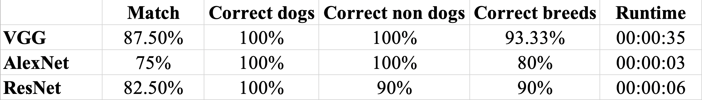
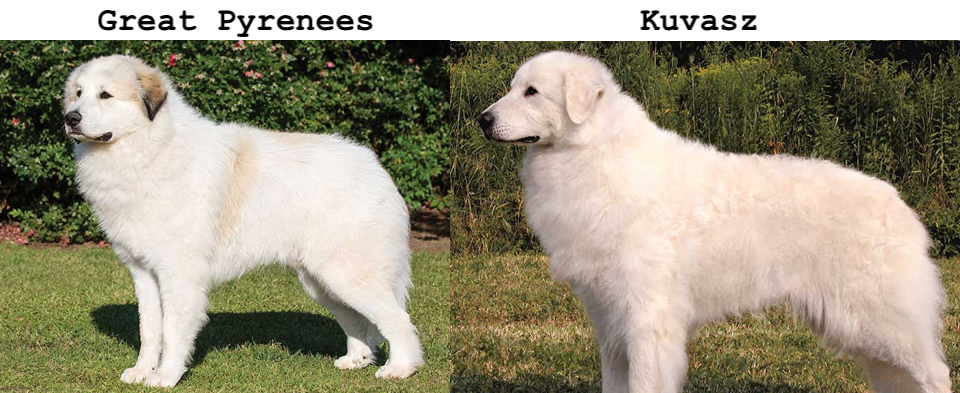
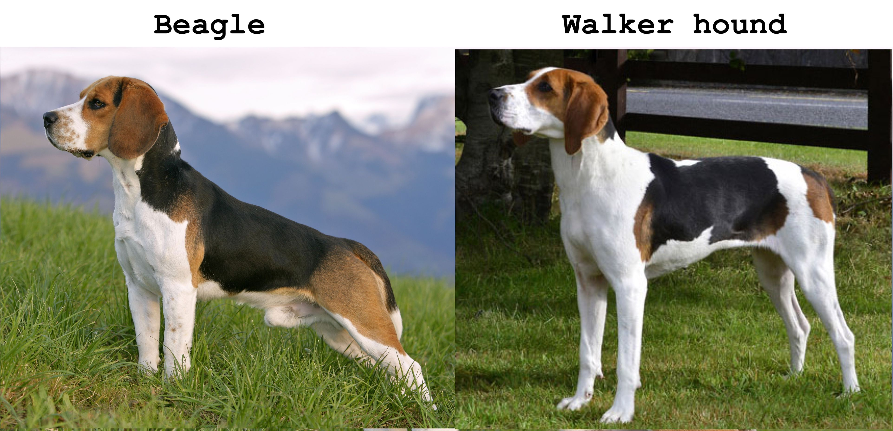
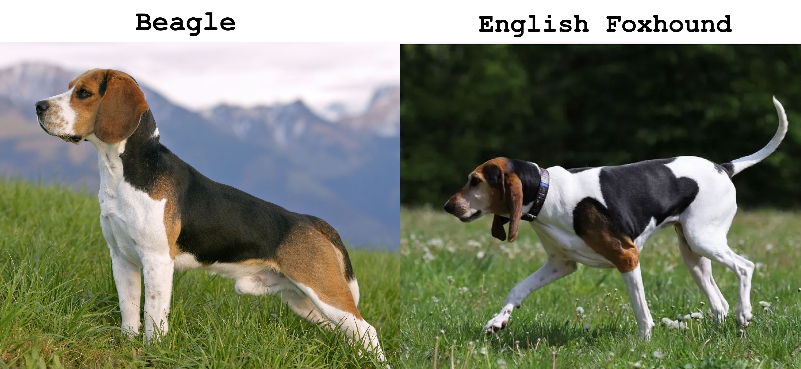
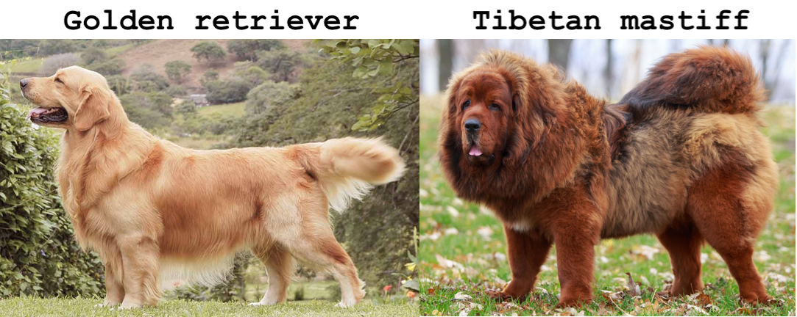
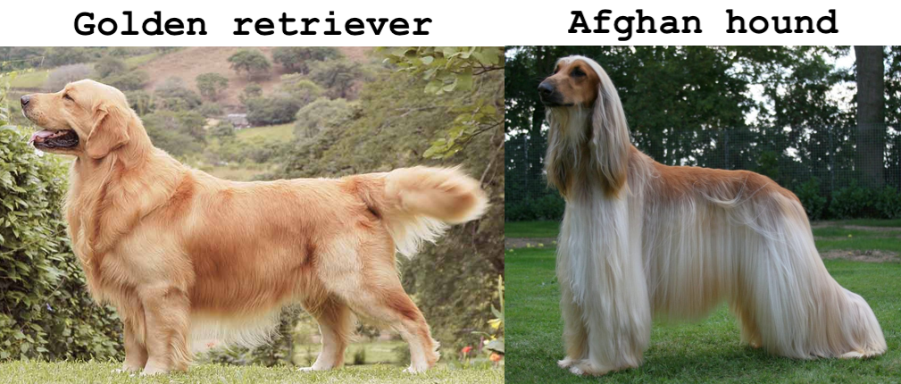
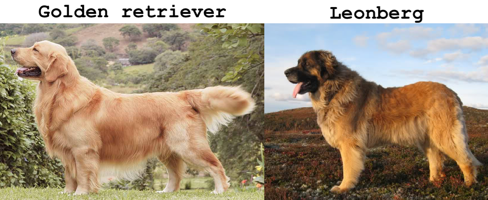
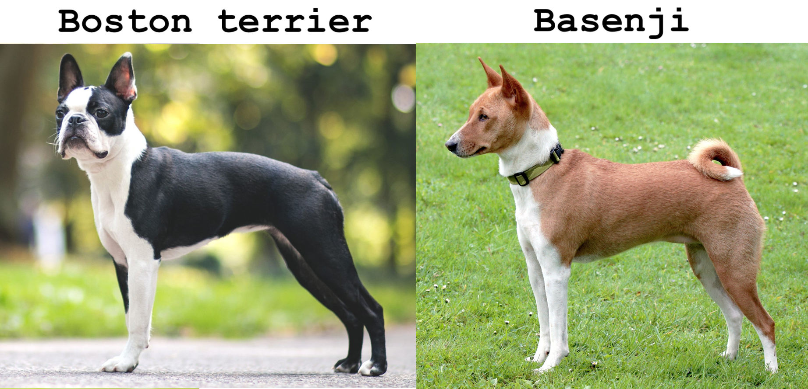

# Use a Pre-Trained Image Classifier to Identify Dog Breeds

This is the first capstone project I worked on while taking the '[AI Programming with Python](https://www.udacity.com/course/ai-programming-python-nanodegree--nd089)' nanodegree at [Udacity](https://www.udacity.com/).

## Project goal
The project goal was to improve our programming skills in Python utilising a *created* image classifier to identify dog breeds. The image classifier used a deep learning model called a **convolutional neural network** (CNN). The CNN that had already learned the features relevant to the identification of dogs from a dataset of 1.2 million images, [ImageNet](https://image-net.org/). The main focus of the project was on Python and not on the actual classifier.

## Languages and tools

   

## Our tasks
Using our Python skills, we had to determine:

➡️ which [Pytorch](https://pytorch.org/) image classification algorithm among AlexNet, VGG, and ResNet performes best on classifying images as **dogs** or **not dogs**.

➡️ how well the best classification algorithm worked on correctly identifying a dog's breed.

➡️ how long each algorithm took to solve the classification problem (*runtime*).

## Forecasted difficulties

It is known that certain breeds of dogs look very similar. Udacity warned us about some breeds which can be easily misclassified: Great Pyrenees and Kuvasz, German Shepherd and Malinois, Beagle and Walker Hound, amongst others. It goes without saying that the more images of two similar-looking dog breeds that the algorithm *learns* from, the more likely the algorithm will be able to distinguish between those two breeds.

## Program Outline

1. Time the program
   - Use Time Module to compute program runtime
2. Get program Inputs from the user
   - Use command line arguments to get user inputs
3. Create Pet Images Labels
   - Use the pet images filenames to create labels
   - Store the pet image labels in a data structure (e.g., a dictionary)
4. Create Classifier Labels and Compare Labels
   - Use the Classifier function to classify the images and create the classifier labels
   - Compare Classifier Labels to Pet Image Labels
   - Store Pet Labels, Classifier Labels, and their comparison in a complex data structure (e.g. dictionary of lists)
5. Classifying Labels as "Dogs" or "Not Dogs"
   - Classify all Labels as "Dogs" or "Not Dogs" using dognames.txt file
   - Store new classifications in the complex data structure (e.g. dictionary of lists)
6. Calculate the Results
   - Use Labels and their classifications to determine how well the algorithm worked on classifying images
7. Print the Results

The tasks in 1-7 were to be repeated for each of the three image classification algorithms provided.

## Results

The total images to classify were 40, 10 of which were not dogs. The three architectures performed as follows:

### Incorrect dog breed assignments

1- Target: great pyrenees. Classifier: kuvasz. (VGG, AlexNet, ResNet)

2- Target: beagle. Classifier: walker hound, walker foxhound. (VGG, AlexNet, ResNet)

3- Target: beagle. Classifier: english foxhound (AlexNet)

4- Target: boston terrier. Classifier: basenji (AlexNet)

5- Target: golden retriever. Classifier: tibetan mastiff (AlexNet)

6- Target: golden retriever. Classifier: afghan hound (AlexNet)

7- Target: golden retriever. Classifier: leonberg (ResNet)

The only breeds mis-identified by the VGG architecture feature impressive similarities. These were also mis-classified by AlexNet and ResNet. Comparative images are provided below:

A similar mis-classification was done by AlexNet, as illustrated below:

Conversely, most mis-classifications done exclusively by AlexNet and/or ResNet were of breeds which shared less distinctive features:

While one of the classifications done by AlexNet, which classified a boston terrier as a basenji, was really ill-advised - the two breeds don't even share similar colours.

