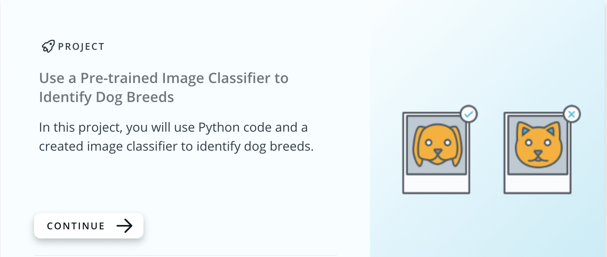
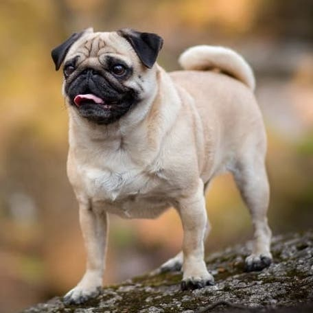
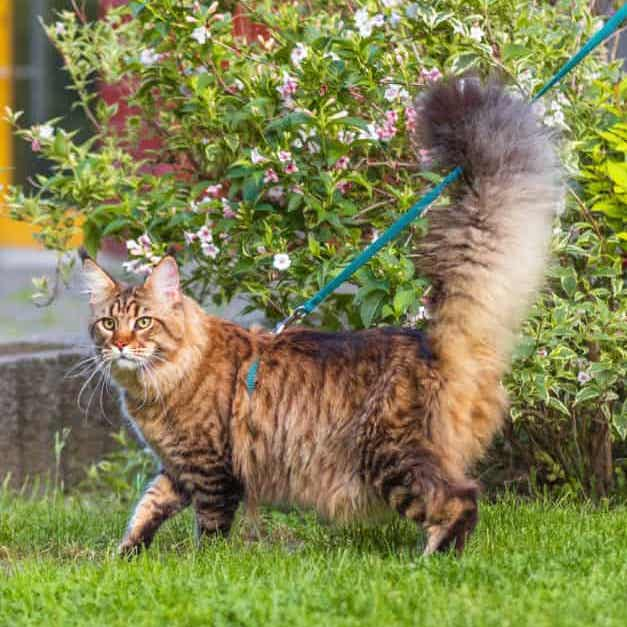
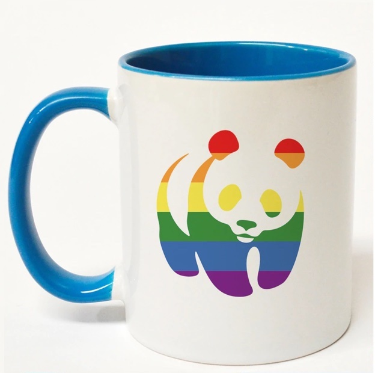
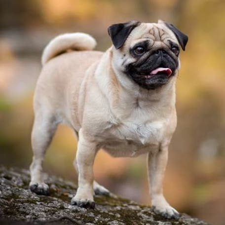
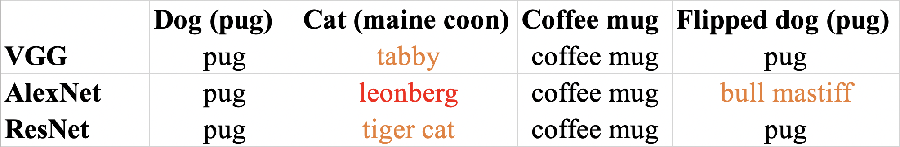
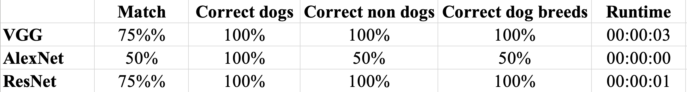

# Use a Pre-Trained Image Classifier to Identify Dog Breeds

This is the first capstone project I worked on while taking the '[AI Programming with Python](https://www.udacity.com/course/ai-programming-python-nanodegree--nd089)' nanodegree at [Udacity](https://www.udacity.com/).

## Project goal
The project goal was to improve our programming skills in Python utilising a *created* image classifier to identify dog breeds. The image classifier used a deep learning model called a **convolutional neural network** (CNN). The CNN that had already learned the features relevant to the identification of dogs from a dataset of 1.2 million images, [ImageNet](https://image-net.org/). The main focus of the project was on Python and not on the actual classifier.

## Languages and tools

   

## Our tasks
Using our Python skills, we had to determine:

➡️ which [Pytorch](https://pytorch.org/) image classification algorithm among AlexNet, VGG, and ResNet performes best on classifying images as **dogs** or **not dogs**.

➡️ how well the best classification algorithm worked on correctly identifying a dog's breed.

➡️ how long each algorithm took to solve the classification problem (*runtime*).

## Forecasted difficulties

It is known that certain breeds of dogs look very similar. Udacity warned us about some breeds which can be easily misclassified: Great Pyrenees and Kuvasz, German Shepherd and Malinois, Beagle and Walker Hound, amongst others. It goes without saying that the more images of two similar-looking dog breeds that the algorithm *learns* from, the more likely the algorithm will be able to distinguish between those two breeds.

## Program Outline

1. Time the program
   - Use Time Module to compute program runtime
2. Get program Inputs from the user
   - Use command line arguments to get user inputs
3. Create Pet Images Labels
   - Use the pet images filenames to create labels
   - Store the pet image labels in a data structure (e.g., a dictionary)
4. Create Classifier Labels and Compare Labels
   - Use the Classifier function to classify the images and create the classifier labels
   - Compare Classifier Labels to Pet Image Labels
   - Store Pet Labels, Classifier Labels, and their comparison in a complex data structure (e.g. dictionary of lists)
5. Classifying Labels as "Dogs" or "Not Dogs"
   - Classify all Labels as "Dogs" or "Not Dogs" using dognames.txt file
   - Store new classifications in the complex data structure (e.g. dictionary of lists)
6. Calculate the Results
   - Use Labels and their classifications to determine how well the algorithm worked on classifying images
7. Print the Results

The tasks in 1-7 were to be repeated for each of the three image classification algorithms provided.

## Results

The total images to classify were 40, 10 of which were not dogs. The three architectures performed as follows:

### Incorrect dog breed assignments

1- Target: great pyrenees. Classifier: kuvasz. (VGG, AlexNet, ResNet)

2- Target: beagle. Classifier: walker hound, walker foxhound. (VGG, AlexNet, ResNet)

3- Target: beagle. Classifier: english foxhound (AlexNet)

4- Target: boston terrier. Classifier: basenji (AlexNet)

5- Target: golden retriever. Classifier: tibetan mastiff (AlexNet)

6- Target: golden retriever. Classifier: afghan hound (AlexNet)

7- Target: golden retriever. Classifier: leonberg (ResNet)

The only breeds mis-identified by the VGG architecture feature impressive similarities. These were also mis-classified by AlexNet and ResNet. Comparative images are provided below:

A similar mis-classification was done by AlexNet, as illustrated below:

Conversely, most mis-classifications done exclusively by AlexNet and/or ResNet were of breeds which shared less distinctive features:

While one of the classifications done by AlexNet, which classified a boston terrier as a basenji, was really ill-advised - the two breeds don't even share similar colours.

### Comments on the results

Of the three architectures, VGG was by far best in all classification tasks. It indeed classified correctly all 'dogs' vs. 'non dogs', like AlexNet, while ResNet only scored 90% in the identification of 'non dogs'. VGG was also impressive at identifying dog breeds, where it scored 93.33%, and merely mis-indentified two images with very similar breeds (great pyrenees with kuvaszs, and beagles with walker hounds). AlexNet and ResNet made less obvious mistakes, with AlexNet going as far as mis-identifying two dog breeds which don't have similar fur colours.

However, the running time of VGG was considerably greater than those of AlexNet and Resnet: respectively, the three architectures took 35", 6" and 3" to perform the task. I would be curious to test the three architectures on a wider range of images.

## Additional task: Uploading 4 new images to further test the performance of the three architectures

The last task required by the project was selecting and uploading four additional pictures to the program, and test how the architectures perform with them. The requirements were that the images be squares, had a .jpg extension, and featured: one dog whose breed we knew, one animal which was not a dog, one object, and one horizontally-flipped version of the selected dog image. My choices were the following:

**Photo 1, dog (pug):**

**Photo 2, cat (maine coon):**

**Photo 3, coffee mug:**

**Photo 4, horizontally-flipped version of Photo 1:**

The task could be performed using the command `sh run_models_batch_uploaded.sh`, which created three text files with the results for each architecture: `vgg_uploaded-images.txt`, `alexnet_uploaded-images.txt`, and `resnet_uploaded-images.txt`.

### Results

The classifications provided by the three architectures are in the table below. I use orange for errors in the recognition of breeds within the right species (e.g., a pug mistaken for a bull terrier), and red for species mistakes (e.g., a main coon mistaken for a leonberg):

The summary statistics are as follows:

VGG and ResNet performed identically in this task, although with expectedly different runtimes of 6" and 3", respectively. Conversely, AlexNet performed poorly, despite the brilliant runtime of 0" - to the point that it incorrectly mistook a cat (maine coon) for a dog (leonberg).

## Final questions

The project required the programmer to answer the following four questions before submission, which were related to the performances of the three model architectures in the last classification. My conclusion was that, because of its runtime, the overall best-performing architecture was ResNet.

**Questions regarding Uploaded Image Classification:**

1. Did the three model architectures classify the breed of dog in Dog_01.jpg to be the same breed? If not, report the differences in the classifications.

Answer: Yes, the three model architectures correctly classified Dog_01.jpg as 'pug'.

2. Did each of the three model architectures classify the breed of dog in Dog_01.jpg to be the same breed of dog as that model architecture classified Dog_02.jpg? If not, report the differences in the classifications.

Answer: VGG and ResNet correctly identified Dog_01.jpg and Dog_02.jpg as 'pug' (note that I actually changed the filenames to Pug_01.jpg and Pug.02.jpg, to obtain right breed classifications). Conversely, AlexNet classified Dog_01.jpg as 'pug' and Dog_02.jpg as 'bull mastiff'.

3. Did the three model architectures correctly classify Animal_Name_01.jpg and Object_Name_01.jpg to not be dogs? If not, report the misclassifications.

Answer: The three model architectures identified the object picture as a non-dog, and correctly classified it as a 'coffee mug'. Conversely, the cat picture was only identified as non-dog by VGG and ResNet, while AlexNet classified it as a dog, 'leonberg'.

4. Based upon your answers for questions 1. - 3. above, select the model architecture that you feel did the best at classifying the four uploaded images. Describe why you selected that model architecture as the best on uploaded image classification.

Answer: VGG and ResNet identified correctly 75% of images. Both were wrong in the identification of the breed of the cat ('maine coon'), which they classified as 'tabby' and 'tiger cat', respectively. Nonetheless, both models identified the cat as such, and did not mistake it for a dog. Overall, the best-performing model architecture for this task was ResNet, because of its runtime of 00:00:03. Indeed, VGG took twice the time to complete the task, 00:00:06.
